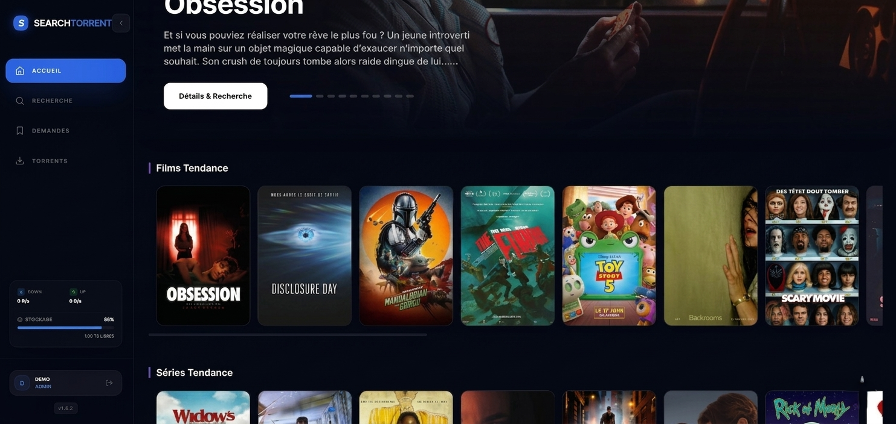
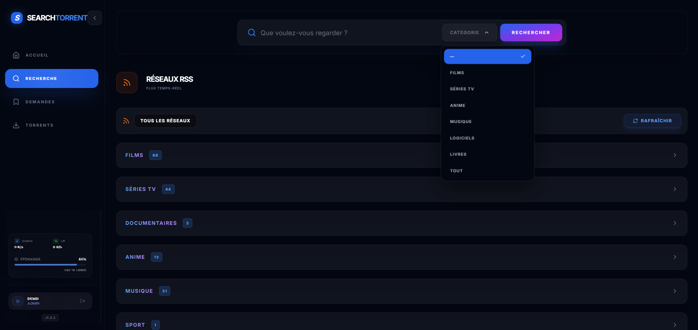
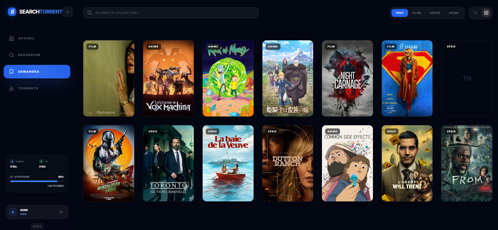

# Search-Torrent



Interface web moderne pour rechercher, suivre et télécharger vos médias via **Prowlarr** et **qBittorrent**.

[](https://hub.docker.com/r/ppo852/search-torrent)


## Fonctionnalités

- **Accueil immersif** — Tendances TMDB, flux RSS récents, navigation rapide
- **Recherche multi-catégories** — Films, séries et anime via TMDB ; musique, logiciels/jeux et livres en recherche directe Prowlarr
- **Demandes & suivi** — Saisons, épisodes, auto-search intelligent
- **qBittorrent intégré** — Gestion des torrents, catégories normalisées (Films, Séries, Anime, Musique, Logiciels, Jeux, Livres…)
- **Flux RSS** — Cache optimisé, enrichissement TMDB, catégories détectées automatiquement
- **Administration** — Utilisateurs, configuration Prowlarr/qBit/TMDB, profils qualité, flux RSS
- **Sécurité** — JWT, bcrypt, secrets via variables d'environnement uniquement
- **Docker ready** — Image légère, base SQLite persistante hors image

## Installation Docker

### Prérequis

- [Prowlarr](https://github.com/Prowlarr/Prowlarr) installé et configuré
- [qBittorrent](https://www.qbittorrent.org/) avec WebUI activée
- Docker et Docker Compose

### Déploiement rapide

1. Créez votre fichier `docker-compose.yml` :

```yaml
services:
  search-torrent:
    image: ppo852/search-torrent:1.6.3
    container_name: search-torrent
    ports:
      - "4000:80"
    volumes:
      - ./data:/app/data
    environment:
      - NODE_ENV=production
      - JWT_SECRET=changez_moi_avec_une_longue_chaine_aleatoire
      - ADMIN_USERNAME=admin
      - ADMIN_PASSWORD=changez_moi
      - LOG_LEVEL=info
    restart: unless-stopped
```

2. Lancez l'application :

```bash
docker compose up -d
```

3. Accédez à `http://localhost:4000` — identifiants = `ADMIN_USERNAME` / `ADMIN_PASSWORD`.

> La base SQLite est stockée dans `./data` (volume monté). Elle n'est **pas** incluse dans l'image Docker Hub.

## Variables d'environnement

| Variable | Description | Défaut |
|----------|-------------|--------|
| `JWT_SECRET` | Clé secrète JWT (**obligatoire** en production) | — |
| `ADMIN_USERNAME` | Identifiant admin au premier démarrage | `admin` |
| `ADMIN_PASSWORD` | Mot de passe admin au premier démarrage | `admin` |
| `LOG_LEVEL` | Niveau de logs : `debug`, `info`, `warn`, `error` | `info` |
| `AUTO_SEARCH_ON_CREATE` | Lance une recherche dès l'ajout d'une demande | `true` |

## Captures d'écran

### Accueil


### Recherche & RSS


### Demandes


### Torrents (qBittorrent)


### Administration


### Connexion


## Stack technique

- **Frontend** — React 18, Vite, Tailwind CSS, Zustand, React Query
- **Backend** — Node.js, Express, SQLite (better-sqlite3)
- **Intégrations** — Prowlarr, qBittorrent, TMDB

## Notes de version

### v1.6.3
- Recherche Prowlarr par catégorie : musique, logiciels (+ jeux), livres
- Normalisation des catégories qBittorrent (`shared/qbit-categories.json`)
- Corrections affichage et envoi des catégories logiciels

### v1.6.x
- Nouvelle sidebar avec stats système (stockage, réseau)
- SearchBar repensée, libellés RSS mis à jour
- Corrections recherche interactive et API

### v1.4.x — bases
- Logging centralisé, audit sécurité, UX saisons 2.0
- `.dockerignore` optimisé (exclusion de `data/`, secrets, etc.)

## Sauvegarde

Toutes vos données sont dans le dossier `./data`. Pensez à le sauvegarder régulièrement.

## Licence

Ce projet est destiné à un usage personnel. Assurez-vous de respecter les droits d'auteur et les règles de vos indexeurs.
