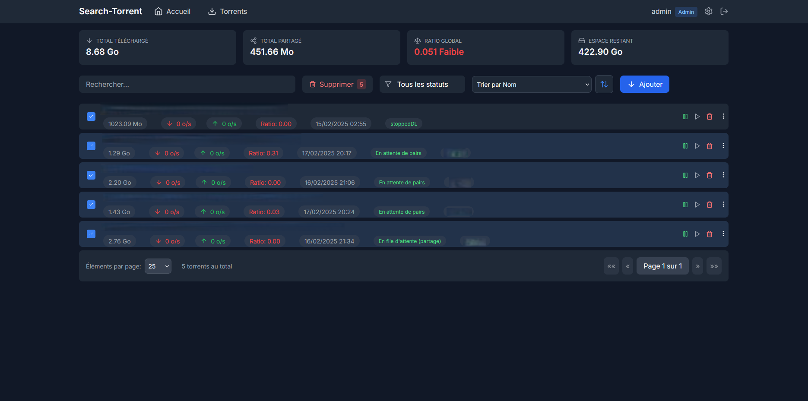
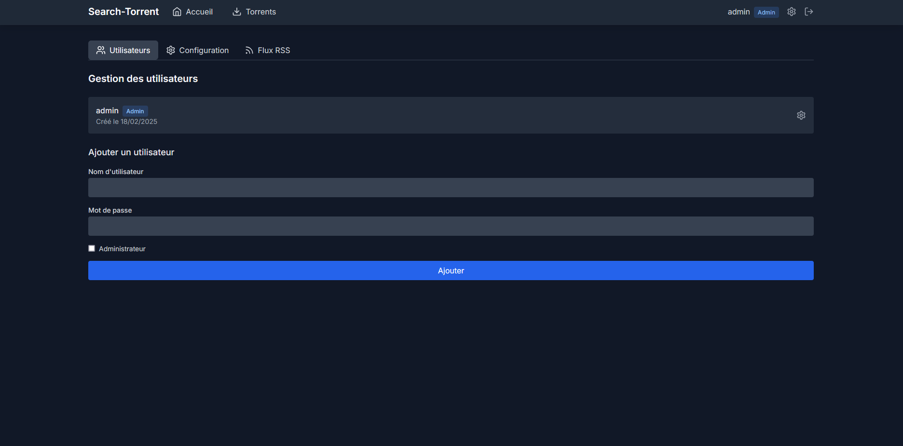
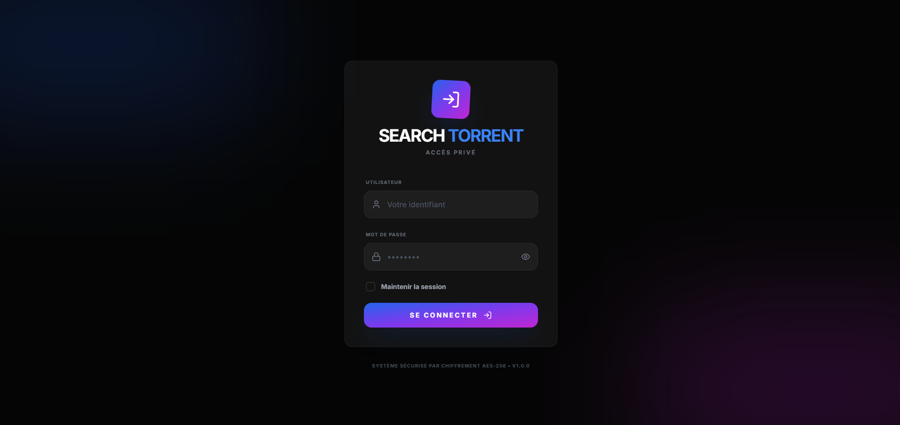

# Search-Torrent


Une interface web moderne et élégante pour gérer vos recherches et téléchargements.

## 🚀 Fonctionnalités

- 🔍 Recherche unifiée dans tous vos indexers Prowlarr
  - Filtrage par catégorie (Films, Séries, Anime, etc.)
  - Tri avancé par nom, taille, sources ou pairs

- 🎬 Intégration TMDB
  - Affichage des posters de films et séries sur les flux RSS
  - Lien direct vers la page TMDB
  - Recherche automatique des métadonnées

- 📥 Intégration qBittorrent
  - Gestion centralisée par l'administrateur
  - Support de l'authentification qBittorrent
  - Téléchargement direct vers qBittorrent

- 🎨 Interface moderne
  - Design responsive et adaptatif
  - Thème sombre élégant
  - Composants réutilisables avec Tailwind CSS
  - Gestion d'état avancée avec Zustand
  - Cache intelligent avec React Query

- 🔄 Gestion des flux RSS
  - Cache optimisé des flux RSS
  - Rafraîchissement manuel via bouton dédié
  - Mise à jour intelligente des données
  - Performance optimisée pour grands volumes

- 🔒 Sécurité
  - Authentification JWT
  - Mots de passe hashés avec bcrypt
  - Protection des routes par rôle

- 🗃️ Base de données
  - SQLite persistante
  - Migrations automatiques

## 🚀 Installation

1. Cloner le dépôt
2. Configurer les variables d'environnement
3. Lancer avec Docker Compose

## 🛠️ Développement

Pour contribuer au projet :

1. Créer une branche pour vos modifications
2. Faire vos modifications
3. Commit et push
4. Créer une Pull Request

## 📸 Captures d'écran

### Page d'accueil

*Interface principale avec recherche de torrents et affichage des flux RSS*

### Gestion des torrents

*Interface de gestion des torrents avec statistiques et contrôles*

### Administration

*Panneau d'administration pour la gestion des utilisateurs*

### Connexion

*Interface de connexion sécurisée*

## 📋 Installation avec Docker

### Prérequis
- **Prowlarr** doit être installé et configuré avec vos indexers
- **qBittorrent** doit être installé et accessible via son interface Web
- Docker et Docker Compose installés sur votre système
- Un serveur Linux (recommandé) ou Windows avec Docker
- Minimum 1GB de RAM recommandé
- 1 CPU core minimum

### Configuration requise
- qBittorrent WebUI doit être activée et accessible
- Version de qBittorrent : 4.1.0 ou supérieure
- L'authentification qBittorrent doit être configurée

### Installation rapide

1. Créez un nouveau dossier pour le projet :
```bash
mkdir prowlarr-search && cd prowlarr-search
```

2. Créez le fichier `docker-compose.yml` :
```yaml
version: '3'
services:
  prowlarr-search:
    image: ppo852/Search-Torrent:latest
    container_name: prowlarr-search
    ports:
      - "80:80"  # L'application sera accessible sur le port 80
    volumes:
      - ./data:/app/data  # Stockage persistant pour la base SQLite
    environment:
      - PUID=1000  # Remplacez par votre User ID
      - PGID=1000  # Remplacez par votre Group ID
      - JWT_SECRET=votre_secret_jwt  # Changez ceci !
    deploy:
      resources:
        limits:
          cpus: '1'
          memory: 1G
    healthcheck:
      test: ["CMD", "curl", "-f", "http://localhost:80"]
      interval: 30s
      timeout: 10s
      retries: 3
    restart: unless-stopped
```

3. Créez le dossier pour les données persistantes :
```bash
mkdir data
chmod 777 data  # Assurez-vous que Docker peut écrire dans ce dossier
```

4. Lancez l'application :
```bash
docker-compose up -d
```

### 🔐 Première connexion

1. Accédez à `http://votre-ip`
2. Connectez-vous avec les identifiants par défaut :
   - Utilisateur : `admin`
   - Mot de passe : `admin`
3. **IMPORTANT** : Changez immédiatement le mot de passe administrateur !

## ⚙️ Configuration

### Configuration initiale (Admin)

Dans les paramètres d'administration, configurez :
1. L'URL et la clé API Prowlarr
2. Le token d'accès TMDB (pour les métadonnées)
3. L'URL et les identifiants qBittorrent (configuration centralisée)
4. Le nombre minimum de sources
5. Ajoutez vos flux RSS Prowlarr
   - Nom du flux
   - URL du flux RSS
   - Catégorie (Films, Séries, etc.)
6. Créez les comptes utilisateurs


---

## 👥 Gestion des rôles (admin / utilisateur)

- **Administrateur** :
  - Accès complet à tous les paramètres (Prowlarr, TMDB, qBittorrent, gestion des flux RSS, gestion des utilisateurs).
  - Peut créer, modifier, supprimer des utilisateurs.
  - Peut modifier les paramètres globaux de l’application.
  - Peut voir et gérer tous les torrents et flux RSS.
- **Utilisateur** :
  - Peut effectuer des recherches, télécharger des torrents, consulter les flux RSS.
  - Peut modifier ses propres préférences d’affichage et filtres de recherche.
  - Ne peut pas accéder à la gestion des utilisateurs ni aux paramètres globaux.

---

## 💾 Sauvegarde et restauration

- Toutes les données importantes (utilisateurs, paramètres, historiques, etc.) sont stockées dans le dossier `./data` (volume Docker).
- **Sauvegarde** : il suffit de faire une copie du dossier `data` pour conserver tous les paramètres et comptes.
- **Restauration** : pour restaurer, il suffit de replacer le dossier `data` sauvegardé à la racine du projet avant de relancer le container Docker.
- **Conseil** : effectuez des sauvegardes régulières du dossier `data` pour éviter toute perte de configuration ou d’utilisateurs.


## 🔄 Gestion du Cache

L'application utilise un système de cache intelligent pour optimiser les performances :
- Cache permanent des configurations utilisateur
- Cache intelligent des flux RSS avec rafraîchissement manuel
- Nettoyage automatique à la déconnexion
- Optimisation de la mémoire pour les grands volumes de données

## ⚡ Performance

L'application est optimisée pour les performances :
- Gestion d'état centralisée avec Zustand
- Mise en cache intelligente avec React Query
- Chargement à la demande des données
- Rafraîchissement contrôlé des flux RSS
- Optimisation des requêtes API

## 🛠️ Technologies utilisées

- [Prowlarr](https://github.com/Prowlarr/Prowlarr) pour la gestion des indexers
- [qBittorrent](https://github.com/qbittorrent/qBittorrent)
- [TMDB](https://www.themoviedb.org/) pour leur API
- [React](https://reactjs.org/) pour le framework frontend
- [Tailwind CSS](https://tailwindcss.com/) pour le système de design
- [Lucide Icons](https://lucide.dev/) pour les icônes
- [Zustand](https://zustand-demo.pmnd.rs/) pour la gestion d'état
- [React Query](https://tanstack.com/query/latest) pour la gestion du cache

## 📝 Notes de version v1.3.0

### 🎨 Nouvelle Interface
- ✨ **Nouvelle page d'accueil style Riven** avec hero section immersive
- 🎬 Affichage des **films et séries tendance** en scroll horizontal
- 🔄 **Boutons de navigation** (flèches gauche/droite) pour défiler facilement les sections
- 📊 **80 médias affichés** au lieu de 40 pour plus de contenu
- 🎯 Design moderne avec effets glassmorphism et animations fluides

### 🔧 Refactoring & Optimisations
- ♻️ **Composants réutilisables** : MediaCard et MediaSection
- 🧹 **Code dupliqué éliminé** : -200 lignes (-58% de réduction)
- 📦 **Fonction formatYear centralisée** dans utils/formatters.ts
- 🗑️ **Suppression de la page Sorties** (doublon avec la nouvelle page d'accueil)
- 🎯 Architecture plus maintenable et évolutive

### 🚀 Backend
- 🆕 **Nouvel endpoint `/api/tmdb/newest`** : combine films now_playing et séries trending
- ⚡ **Cache TMDB optimisé** : 1 heure avec invalidation intelligente
- 🔒 **Sécurité JWT maintenue** et renforcée
- 📈 **Performance améliorée** : filtrage et entrelacement des résultats

### 📱 Navigation Simplifiée
- 🏠 **Accueil** : Nouveautés TMDB style Riven (films + séries tendance)
- 🔍 **Recherche** : Flux RSS et torrents (ancienne page d'accueil renommée)
- 📚 **Demandes** : Bibliothèque de demandes médias
- ⚙️ **qBittorrent** : Gestion des torrents
- 👤 **Admin** : Panneau d'administration

### 🐛 Corrections
- ✅ Analyse complète du code : 0 duplication, 0 code fantôme
- ✅ Validation croisée par 2 IA pour garantir la qualité
- ✅ Production ready avec Docker multi-stage optimisé

---

## 📝 Notes de version v1.2

### Nouveautés
- Réorganisation complète de l'arborescence des fichiers pour une meilleure maintenabilité
- Ajout de la catégorisation automatique selon le type de fichier téléchargé
- Refonte de l'interface pour une utilisation optimale sur petits écrans (responsive mobile)

### Améliorations
- Préparation complète à la mise en production (sécurité, logs, typage, Docker)
- Correction de bugs mineurs dans les composants de recherche
- Optimisation de la configuration Docker et instructions d'installation
- Renforcement des bonnes pratiques de sécurité (changement du mot de passe admin, gestion des secrets)

---

## 📝 Notes de version v1.1

### Nouvelles fonctionnalités
- Interface de gestion des torrents améliorée
- Nouveau design plus moderne et intuitif
- Gestion centralisée des paramètres qBittorrent par l'administrateur
- Intégration avec Prowlarr pour la recherche de torrents
- Support multi-utilisateurs avec rôles admin/utilisateur
- Gestion des flux RSS Prowlarr

### Corrections et améliorations
- Optimisation de la stabilité du cache RSS
- Amélioration des performances de recherche
- Interface responsive et adaptative
- Meilleure gestion des erreurs
- Sécurisation des données sensibles