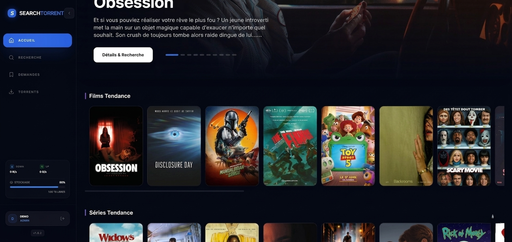
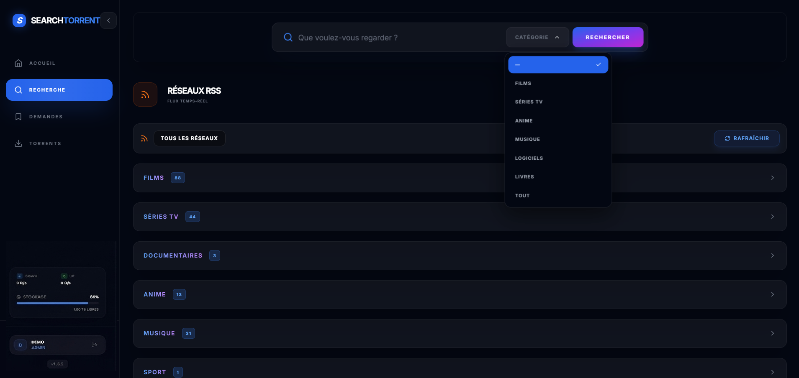
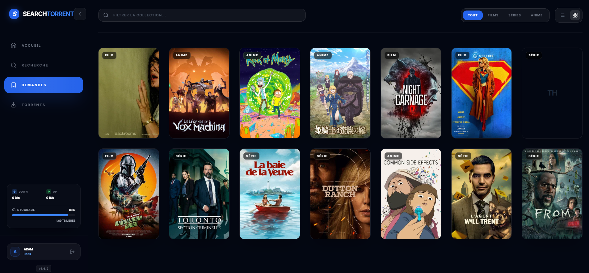
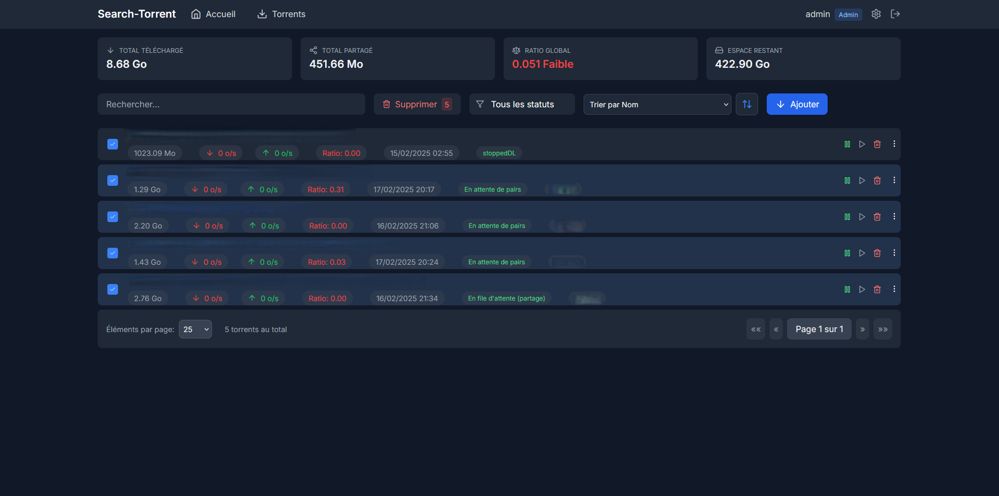
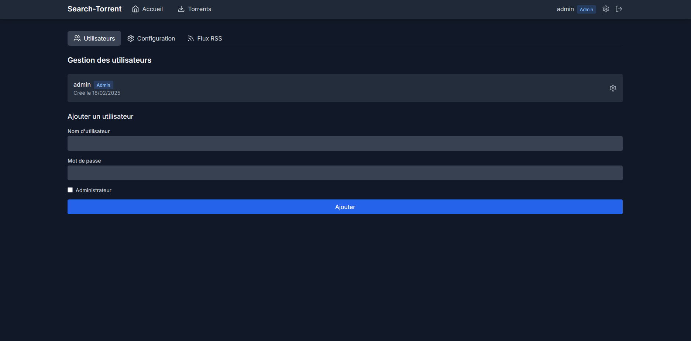
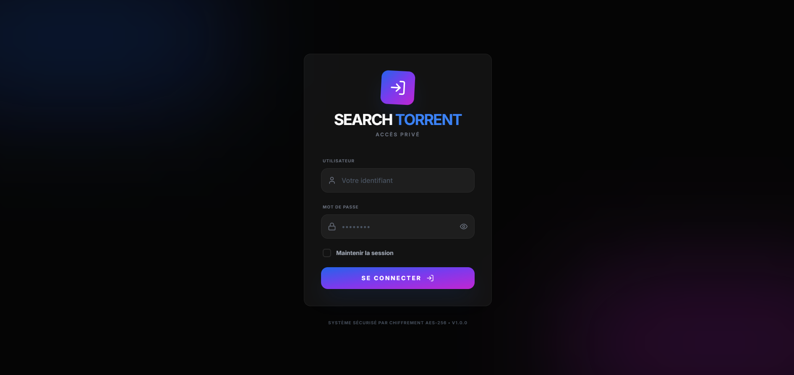

# Search-Torrent



Interface web moderne pour rechercher, suivre et télécharger vos médias via **Prowlarr** et **qBittorrent**.

[](https://hub.docker.com/r/ppo852/search-torrent)


## Fonctionnalités

- **Accueil immersif** — Tendances TMDB, flux RSS récents, navigation rapide
- **Recherche multi-catégories** — Films, Animation, séries, anime via TMDB ; musique, logiciels/jeux et livres en recherche directe Prowlarr
- **Demandes & suivi** — Films / Animation / séries / anime, saisons, épisodes, auto-search intelligent
- **Fiche média** — Filtres résultats, bande-annonce TMDB, profil qualité en recherche interactive
- **qBittorrent intégré** — Gestion des torrents, export `.torrent`, catégories normalisées (Films, Animation, Séries, Anime, Musique, Logiciels, Jeux, Livres…)
- **Emby** — Sync inventaire, statut dernier sync, panneau admin
- **Flux RSS** — Cache optimisé, enrichissement TMDB, catégories détectées automatiquement
- **Paramètres** — Système (santé), Intégrations, Inventaire & planification, Qualité, RSS, Utilisateurs, Historique ; test & sauvegarde Prowlarr/TMDB/Emby
- **Sécurité** — JWT, bcrypt, secrets via variables d'environnement uniquement
- **Docker ready** — Image légère, base SQLite persistante hors image ; stack locale optionnelle (Prowlarr + qBit + Emby)

## Installation Docker

### Prérequis

- [Prowlarr](https://github.com/Prowlarr/Prowlarr) installé et configuré
- [qBittorrent](https://www.qbittorrent.org/) avec WebUI activée
- [Emby](https://emby.media/) (optionnel — sync inventaire)
- Docker et Docker Compose

### Déploiement production (Docker Hub)

Le dépôt inclut un `docker-compose.yml` générique prêt à l'emploi :

```bash
docker compose pull
docker compose up -d
```

Accédez à `http://localhost:4000` — au premier démarrage : **admin** / **admin** (changez le mot de passe ensuite dans les paramètres utilisateur).

> La base SQLite est dans `./data` (volume monté). Elle n'est **pas** incluse dans l'image Docker Hub.

### Développement local (build depuis les sources)

App seule :

```bash
cp docker-compose.dev.yml.example docker-compose.dev.yml
docker compose -f docker-compose.dev.yml up -d --build
```

Stack complète (Search-Torrent + Prowlarr + qBittorrent + Emby) :

```bash
cp docker-compose.stack.yml.example docker-compose.stack.yml
docker compose -f docker-compose.stack.yml up -d --build
```

| Service | URL |
|---------|-----|
| Search-Torrent | http://localhost:4000 (admin / admin) |
| Prowlarr | http://localhost:9696 |
| qBittorrent | http://localhost:8080 |
| Emby | http://localhost:8096 |

Dans l’app, utiliser les URLs Docker internes : `http://prowlarr:9696`, `http://qbittorrent:8080`, `http://emby:8096`.  
Dossier de téléchargements partagé : `/downloads`.

## Configuration qBittorrent

Pour que Search-Torrent envoie correctement les catégories (`Films`, `Séries`, `Anime`, etc.) et que les fichiers aillent dans le bon dossier :

### 1. Interface Web

**Paramètres → Interface Web**

- Activer l'**interface Web distante**
- Noter l'URL interne Docker (ex. `http://qbittorrent:8080`)
- **Générer une clé API** (qBittorrent 5.2+) : Préférences → Web UI → section Clé API
- Renseigner l'URL et la clé (`qbt_...`) dans Search-Torrent (paramètres utilisateur)

### 2. Gestion automatique des torrents

**Paramètres → Téléchargements**

- **Mode de gestion de torrent par défaut** → **Automatique**
- **Lorsque la catégorie du torrent change** → **Déplacer le torrent**

Ces deux réglages sont le minimum pour que Search-Torrent puisse assigner une catégorie (`Films`, `Séries`, `Anime`, etc.) et que qBittorrent range le torrent au bon endroit.

### 3. Catégories — création automatique

> **Vous n'avez pas besoin de créer les catégories à la main.** Quand Search-Torrent envoie un torrent avec une catégorie, qBittorrent la **crée automatiquement** si elle n'existe pas encore (`Films`, `Animation`, `Séries`, `Anime`, `Musique`, `Logiciels`, `Jeux`, `Livres`, `Autres`…).

> **Optionnel** — si vous voulez un dossier spécifique par catégorie dès le départ, vous pouvez définir le chemin de sauvegarde après coup : clic droit sur la catégorie dans qBittorrent → **Définir le chemin de sauvegarde**. Sinon, qBittorrent utilise le dossier de téléchargement par défaut + sous-dossier de la catégorie.

## Variables d'environnement

| Variable | Description | Défaut |
|----------|-------------|--------|
| `JWT_SECRET` | Clé secrète JWT (**obligatoire** en production) | — |
| `LOG_LEVEL` | Niveau de logs : `debug`, `info`, `warn`, `error` | `info` |
| `AUTO_SEARCH_ON_CREATE` | Lance une recherche dès l'ajout d'une demande | `true` |

> Compte initial : **admin** / **admin** (créé au premier démarrage). Changez le mot de passe dans l’app.

## Captures d'écran

### Accueil


### Recherche & RSS


### Demandes


### Torrents (qBittorrent)


### Paramètres


### Connexion


## Stack technique

- **Frontend** — React 18, Vite, Tailwind CSS, Zustand, React Query
- **Backend** — Node.js, Express, SQLite
- **Intégrations** — Prowlarr, qBittorrent, TMDB, Emby

## Notes de version

### v1.6.9
- **Animation** — catégorie Films Animation (genre TMDB 16) : recherche, demandes, chemins user, qBit `Animation`, inventaire
- **Emby** — sync inventaire, persistance dernier sync, panneau admin (Intégrations)
- **Anti-doublon** — disque ∪ Emby ; badges pochettes (Demandé / En bibliothèque / Partiel / Complète)
- **Paramètres** — onglets réorganisés (Système en premier, Inventaire & planification) ; test/sauvegarde Prowlarr & TMDB ; historique d’activité (rétention 30 j)
- **What’s New** — modal après mise à jour (version vue par utilisateur)
- **qBittorrent** — export fichier `.torrent` ; menu actions (rafraîchir / vérifier / exporter)
- **Toasts** — conflits 409 (« déjà présent ») en info, pas en erreur rouge
- **Espace disque** — mesure basée sur les chemins user (plus fiable sous Windows / multi-volumes)
- **Docker** — exemple de stack locale complète (app + Prowlarr + qBittorrent + Emby) via `docker-compose.stack.yml.example`

### v1.6.8
- Auth qBittorrent par **clé API** uniquement (5.2+, header `Authorization: Bearer qbt_...`)
- Suppression identifiant/mot de passe qBit en base et dans l'admin
- Remplace l'auth login/cookie de la v1.6.6 (plus de `/api/v2/auth/login`, plus de cache session)
- Sidebar : totaux session qBit (↓/↑ cumulés depuis le dernier reboot)

### v1.6.7
- Fix doublons auto-search : `getSeasonPresence` match aussi par titre (pas seulement TMDB)

### v1.6.6 *(auth qBit remplacée par v1.6.8)*
- Compatibilité qBittorrent 5.2+ : auth login (`204` / body vide) + cookie `QBT_SID_*`
- Rétrocompatible avec les anciennes versions qBit (`200` + `Ok.`)

### v1.6.5
- Seedbar : vitesses Up/Down synchronisées avec qBit via `transfer/info` (refresh 5 s)
- Parsing JSON qBittorrent plus robuste (vitesses globales correctement lues)
- Saisons : complétion automatique au scan, purge historique après délai configurable
- Auto-search : ignore les packs saison si des épisodes sont déjà présents (évite les doublons)
- Sync présence disque à l'ouverture d'une saison + enregistrement des téléchargements épisode/pack

### v1.6.4
- Filtres page résultats : qualité (480p–4K), langue (profil admin, MULTI, VF, VOSTFR, VO), saison (séries)
- Recherche interactive : compatibilité profil admin côté serveur (`is_compatible`, mots-clés sans filtre taille)
- Bande-annonce TMDB sur la fiche média (vidéos locale FR, sélection intelligente, modale embed)
- Correction déconnexion intempestive : le 401 ne déconnecte plus que les appels `/api/` locaux
- Sécurité : routes gestion utilisateurs réservées aux administrateurs
- Nettoyage code mort (`MediaDetailPage`, utilitaires trailer)

### v1.6.3
- Recherche Prowlarr par catégorie : musique, logiciels (+ jeux), livres
- Normalisation des catégories qBittorrent (`shared/qbit-categories.json`)
- Corrections affichage et envoi des catégories logiciels

### v1.6.x
- Nouvelle sidebar avec stats système (stockage, réseau)
- SearchBar repensée, libellés RSS mis à jour
- Corrections recherche interactive et API

### v1.4.x — bases
- Logging centralisé, audit sécurité, UX saisons 2.0
- `.dockerignore` optimisé (exclusion de `data/`, secrets, etc.)

## Sauvegarde

Toutes vos données sont dans le dossier `./data`. Pensez à le sauvegarder régulièrement.

## Licence

Ce projet est destiné à un usage personnel. Assurez-vous de respecter les droits d'auteur et les règles de vos indexeurs.
